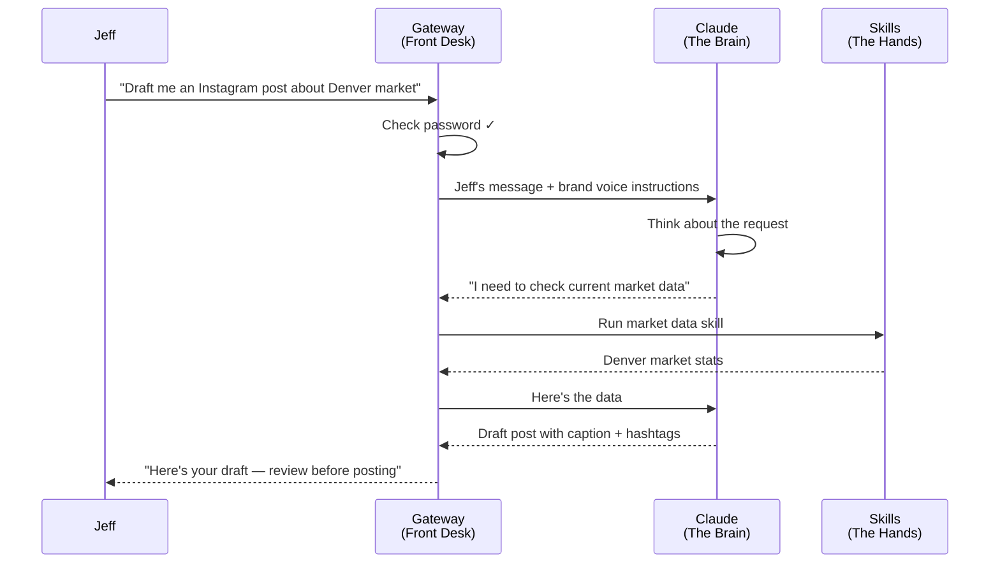

# Diagram Specifications — OpenClaw for Jeff

**Date:** 2026-03-03
**Methodology:** Concept-to-pattern mapping (style guide 5.5-5.6)
**Color reference:** engine/templates/diagram-color-reference.md
**Design constraint:** Jeff has zero technical background. Every diagram must communicate its concept through structure alone (isomorphism test), with labels in plain language reinforcing — not carrying — the meaning.

---

## Diagram Index

| # | Concept | Section | Pattern | Rendering | Isomorphism |
|---|---------|---------|---------|-----------|-------------|
| 1 | How OpenClaw works — the four pieces and their relationships | 1 (Intro) | Regions | Rough.js | PASS — boundary rectangle around local components visually communicates "these live together on your machine," external circles outside communicate "these live elsewhere" |
| 2 | Why a dedicated machine — shared vs. isolated | 2 (Dedicated Machine) | Side-by-Side | Rough.js | PASS — two columns with different density/overlap visually communicate "crowded/risky" vs. "clean/separated" without any labels |
| 3 | Security layers — defense in depth | 5 (Security) | Tree / Nested Layers | Rough.js | PASS — concentric rectangles visually communicate containment and layered protection; innermost = most protected |
| 4 | How a prompt becomes action | 6 (Prompting) | Sequence | Mermaid sequence | PASS — vertical lifelines with horizontal arrows visually communicate ordered back-and-forth between distinct actors |
| 5 | Split architecture workflow — end to end | 7 (Social Media) | Assembly Line | Rough.js | PASS — left-to-right transformation chain visually communicates "input transforms through stages into output," with a clear handoff boundary between creation and publishing |
| 6 | What stays local vs. what leaves | Cross-cutting (shown in Section 1 or 5) | Regions | Rough.js | PASS — two labeled zones (local boundary, internet boundary) with elements sorted into each visually communicate what's private vs. what travels. Distinct from Diagram 1 because this diagram's structure is a BOUNDARY with items on either side, while Diagram 1's structure is CONTAINMENT with components connected inside |

## Variety Rule Check

Six diagrams, five distinct patterns used:

- **Regions:** Diagrams 1 and 6. Justified — Diagram 1 shows containment (components inside a machine boundary with connections between them). Diagram 6 shows partitioning (data items sorted into two zones separated by a boundary line). Structurally different: one is a system map, the other is a classification diagram. Remove labels and they look different — Diagram 1 has connectors between nodes inside a rectangle; Diagram 6 has items distributed across two regions separated by a dividing line.
- **Side-by-Side:** Diagram 2 only.
- **Tree / Nested Layers:** Diagram 3 only.
- **Sequence:** Diagram 4 only.
- **Assembly Line:** Diagram 5 only.

No two diagrams will look structurally identical. Variety rule satisfied.

---

## Diagram 1: The Four Pieces of OpenClaw

**Concept:** OpenClaw has four components (Gateway, LLM Connection, Skills, Dashboard). Three run locally on Jeff's MacBook; one (LLM) is an external service. They connect in specific ways.
**Behavior:** Groups related components into logical zones — local machine vs. external services — with connections showing how they interact.
**Pattern:** Regions (labeled boundaries enclosing elements)
**Rendering:** Rough.js
**Isomorphism:** Remove labels. A large dashed rectangle contains three connected rectangles. Outside it, a circle connects via an arrow that crosses the boundary. Structure communicates: "these things are grouped together; that thing is outside." PASS.

**Nodes:**

| Element | Semantic Category | Fill (Light) | Stroke (Light) | Fill (Dark) | Stroke (Dark) |
|---------|------------------|-------------|----------------|------------|----------------|
| Gateway | Infrastructure | `#dbeafe` | `#3b82f6` | `#1e3a5f` | `#60a5fa` |
| Skills | Data/Config | `#dcfce7` | `#22c55e` | `#052e16` | `#4ade80` |
| Dashboard | Infrastructure | `#dbeafe` | `#3b82f6` | `#1e3a5f` | `#60a5fa` |
| Claude (LLM) | Agent/LLM | `#f3e8ff` | `#a855f7` | `#3b0764` | `#c084fc` |
| Jeff's MacBook Air (boundary) | Neutral | no fill | `#a8a29e` | no fill | `#737373` |

**Layout description:**
- Canvas: 720px x 300px
- Large dashed rectangle (neutral stroke) labeled "Jeff's MacBook Air" spans most of the canvas
- Inside: Gateway (center-left, standard rectangle), Dashboard (top-right, standard rectangle), Skills (bottom-right, standard rectangle)
- Gateway connects to Dashboard with a bidirectional arrow (labeled "manages")
- Gateway connects to Skills with a bidirectional arrow (labeled "executes")
- Outside the boundary (right side): Claude circle/ellipse (Agent/LLM category, cross-hatch fill)
- Arrow from Gateway through the boundary to Claude, labeled "sends prompts / receives responses"
- The boundary-crossing arrow uses red stroke (security boundary crossing, 3px) to signal "this is where data leaves your machine"
- Annotation below the boundary: "Everything inside this box stays on your computer"

**Jeff-level labels:**
- Gateway: "Front Desk"
- Skills: "The Hands"
- Dashboard: "Control Panel"
- Claude: "The Brain (rented)"
- Boundary label: "Your MacBook Air"

---

## Diagram 2: Shared Machine vs. Dedicated Machine

**Concept:** Jeff's MacBook runs OpenClaw alongside his personal apps, email, banking, and client data. A dedicated machine would isolate agent activity. This diagram shows the risk of sharing vs. the safety of separation.
**Behavior:** Compares two alternatives — shared machine (current reality) vs. dedicated machine (ideal).
**Pattern:** Side-by-Side (parallel columns with visual contrast)
**Rendering:** Rough.js
**Isomorphism:** Remove labels. Left column shows many overlapping elements crammed into one box. Right column shows elements cleanly separated into two boxes. Structure communicates "crowded and mixed" vs. "clean and separated." PASS.

**Nodes:**

| Element | Semantic Category | Fill (Light) | Stroke (Light) | Fill (Dark) | Stroke (Dark) |
|---------|------------------|-------------|----------------|------------|----------------|
| OpenClaw | Infrastructure | `#dbeafe` | `#3b82f6` | `#1e3a5f` | `#60a5fa` |
| Client Data | Data/Config | `#dcfce7` | `#22c55e` | `#052e16` | `#4ade80` |
| Banking / Email | User/Operator | `#fef3c7` | `#f59e0b` | `#451a03` | `#fbbf24` |
| Browser Sessions | User/Operator | `#fef3c7` | `#f59e0b` | `#451a03` | `#fbbf24` |
| "If breach..." annotation area | Security | `#fee2e2` | `#ef4444` | `#450a0a` | `#f87171` |

**Layout description:**
- Canvas: 720px x 350px
- Two columns, equal width (~320px each), separated by 40px gap
- **Left column — "Jeff's Setup (Shared Machine)":**
  - Single neutral-stroke dashed rectangle containing ALL elements: OpenClaw (blue), Client Data (green), Banking/Email (amber), Browser Sessions (amber)
  - Elements overlap slightly or are tightly packed to visually communicate "everything is together"
  - Red dashed annotation line from OpenClaw to Client Data with label: "If breach: agent can reach client data"
  - Header above column: "Your Setup" with caution indicator
- **Right column — "Ideal (Dedicated Machine)":**
  - TWO separate neutral-stroke rectangles, vertically stacked with visible gap
  - Top box: OpenClaw only (blue)
  - Bottom box: Client Data + Banking + Browser Sessions
  - No connecting lines between the two boxes — visual gap communicates separation
  - Header above column: "Ideal Setup" with checkmark
- Annotation below both columns: "Multiple security layers compensate — but dedicated is better"

---

## Diagram 3: Security Layers — Defense in Depth

**Concept:** Jeff's deployment has four concentric security boundaries. Each layer independently prevents a class of attack. Even if one layer fails, the others still protect.
**Behavior:** Has hierarchy and nesting — each security layer contains the next, creating depth.
**Pattern:** Tree / Nested Layers (concentric shapes)
**Rendering:** Rough.js
**Isomorphism:** Remove labels. Concentric rectangles, each smaller than the one containing it, with the innermost being the smallest. Structure alone communicates "layers of protection around something valuable at the center." PASS.

**Nodes:**

| Element | Semantic Category | Fill (Light) | Stroke (Light) | Fill (Dark) | Stroke (Dark) |
|---------|------------------|-------------|----------------|------------|----------------|
| Outermost: macOS Firewall + FileVault | Security | `#fee2e2` | `#ef4444` | `#450a0a` | `#f87171` |
| Layer 2: Localhost Binding | Security | `#fee2e2` (lighter opacity) | `#ef4444` | `#450a0a` (lighter opacity) | `#f87171` |
| Layer 3: Gateway Authentication | Security | `#fee2e2` (lighter opacity) | `#ef4444` | `#450a0a` (lighter opacity) | `#f87171` |
| Layer 4: Docker Sandbox | Security | `#fee2e2` (lighter opacity) | `#ef4444` | `#450a0a` (lighter opacity) | `#f87171` |
| Center: Jeff's Agent + Data | Data/Config | `#dcfce7` | `#22c55e` | `#052e16` | `#4ade80` |

**Layout description:**
- Canvas: 500px x 400px, centered
- Five concentric rectangles, each inset ~30px from the one outside it
- Outermost rectangle: full red-security stroke, labeled "macOS Firewall + FileVault" (top-center, outside the rectangle)
- Second rectangle: security stroke, labeled "Localhost Only" on the right edge
- Third rectangle: security stroke, labeled "Gateway Password" on the right edge
- Fourth rectangle: security stroke, labeled "Docker Sandbox" on the right edge
- Innermost area (center): small green-filled rectangle labeled "Your Agent + Your Data"
- Right-side annotations for each layer describe what it blocks:
  - Firewall: "Blocks: network probes"
  - Localhost: "Blocks: anyone not on this computer"
  - Auth: "Blocks: unauthorized access"
  - Sandbox: "Blocks: agent escaping its room"
- Annotation below: "Each layer holds independently. If one fails, the others still protect."
- Decreasing opacity on security fill from outer to inner to create visual depth effect (outer is most opaque, inner is least)

---

## Diagram 4: How a Prompt Becomes Action

**Concept:** When Jeff sends a message, it passes through multiple actors in sequence: Jeff types it, Gateway receives it, Claude thinks about it, Skills may execute an action, and the response returns to Jeff. This is an ordered interaction between named actors.
**Behavior:** Shows ordered interactions between actors — message passes from actor to actor with responses returning.
**Pattern:** Sequence (vertical lifelines with horizontal messages)
**Rendering:** Mermaid sequence diagram
**Isomorphism:** Remove labels. Vertical lines with horizontal arrows between them, some arrows going right, some going left (return). Structure communicates "ordered back-and-forth communication between distinct entities." PASS.

**Mermaid source:**

**Color mapping for Mermaid:**
- Jeff participant: amber accent (User/Operator)
- Gateway participant: blue accent (Infrastructure)
- Claude participant: purple accent (Agent/LLM)
- Skills participant: green accent (Data/Config)

**Note:** Mermaid's built-in sequence diagram rendering handles layout automatically. Apply participant colors via CSS overrides on the rendered SVG to match the semantic color system.

---

## Diagram 5: Split Architecture — Content Creation to Instagram

**Concept:** Jeff's Instagram workflow has two distinct phases: content creation (OpenClaw + Claude) and content publishing (Zapier + Instagram API). The split exists because OpenClaw has no native Instagram skill, and this separation is actually better — agent for thinking, automation for mechanical posting.
**Behavior:** Transforms input through stages — Jeff's idea becomes a prompt, becomes a draft, gets approved, gets published. Linear transformation chain with a clear handoff boundary.
**Pattern:** Assembly Line (before -> process -> after)
**Rendering:** Rough.js
**Isomorphism:** Remove labels. A chain of connected shapes flowing left to right, with a vertical dividing line partitioning the chain into two zones. Structure communicates "input transforms through stages, with a handoff point in the middle." PASS.

**Nodes:**

| Element | Semantic Category | Fill (Light) | Stroke (Light) | Fill (Dark) | Stroke (Dark) |
|---------|------------------|-------------|----------------|------------|----------------|
| Jeff (input) | User/Operator | `#fef3c7` | `#f59e0b` | `#451a03` | `#fbbf24` |
| OpenClaw Gateway | Infrastructure | `#dbeafe` | `#3b82f6` | `#1e3a5f` | `#60a5fa` |
| Claude | Agent/LLM | `#f3e8ff` | `#a855f7` | `#3b0764` | `#c084fc` |
| Draft Content | Data/Config | `#dcfce7` | `#22c55e` | `#052e16` | `#4ade80` |
| Jeff Reviews (approval gate) | User/Operator | `#fef3c7` | `#f59e0b` | `#451a03` | `#fbbf24` |
| Zapier | External Service | `#e0e7ff` | `#6366f1` | `#312e81` | `#818cf8` |
| Instagram | External Service | `#e0e7ff` | `#6366f1` | `#312e81` | `#818cf8` |

**Layout description:**
- Canvas: 720px x 280px
- Left-to-right flow across the full width
- **Zone 1 — "Content Creation" (left ~60% of canvas):**
  - Light blue-tinted background region (subtle, not a border — just a wash)
  - Jeff (ellipse, left edge) -> arrow -> OpenClaw Gateway (rectangle) -> arrow -> Claude (ellipse) -> arrow -> Draft Content (rectangle)
  - Arrow back from Draft Content to Jeff (dashed, below main flow) labeled "Review & approve"
  - Zone label above: "Content Creation (OpenClaw + Claude)"
- **Handoff boundary:** Vertical dashed line in red-security color
  - Label on the line: "Human approval required"
- **Zone 2 — "Content Publishing" (right ~40% of canvas):**
  - Light indigo-tinted background region
  - Approved Content -> arrow -> Zapier (rectangle) -> arrow -> Instagram (ellipse)
  - Zone label above: "Publishing (Zapier)"
- Annotation below: "Agent creates. Automation publishes. Jeff approves in between."

**Design rationale:** The assembly line pattern with a clear midpoint boundary communicates the most important insight: the human review gate between creation and publishing. The two background zones reinforce that these are different systems doing different jobs. DNA Principle #10 (Agent vs. Automation Honesty) is visually encoded in the structure.

---

## Diagram 6: What Stays Local vs. What Leaves

**Concept:** Jeff's data has two destinies: most of it stays on his MacBook (private), and only specific items leave over the internet (conversation text to Claude for processing, published content to Instagram). Jeff needs to see this partition clearly.
**Behavior:** Groups items into two logical zones separated by a boundary — local vs. internet.
**Pattern:** Regions (spatial grouping with boundary)
**Rendering:** Rough.js
**Isomorphism:** Remove labels. A vertical dividing line with items clustered on the left and items clustered on the right. Arrows cross the boundary from specific left items to specific right destinations. Structure communicates "things on this side stay here; things that cross go there." Distinct from Diagram 1 because Diagram 1 is a system map (components with connections inside a container); this is a data classification diagram (items sorted into two zones). PASS.

**Nodes:**

| Element | Semantic Category | Fill (Light) | Stroke (Light) | Fill (Dark) | Stroke (Dark) |
|---------|------------------|-------------|----------------|------------|----------------|
| Conversation History | Data/Config | `#dcfce7` | `#22c55e` | `#052e16` | `#4ade80` |
| API Keys | Data/Config | `#dcfce7` | `#22c55e` | `#052e16` | `#4ade80` |
| Skills & Config | Data/Config | `#dcfce7` | `#22c55e` | `#052e16` | `#4ade80` |
| Agent Memory (SOUL.md) | Data/Config | `#dcfce7` | `#22c55e` | `#052e16` | `#4ade80` |
| Draft Content | Data/Config | `#dcfce7` | `#22c55e` | `#052e16` | `#4ade80` |
| Prompt Text (in transit) | Agent/LLM | `#f3e8ff` | `#a855f7` | `#3b0764` | `#c084fc` |
| Published Post | External Service | `#e0e7ff` | `#6366f1` | `#312e81` | `#818cf8` |
| Claude (Anthropic) | Agent/LLM | `#f3e8ff` | `#a855f7` | `#3b0764` | `#c084fc` |
| Instagram (Meta) | External Service | `#e0e7ff` | `#6366f1` | `#312e81` | `#818cf8` |
| Local zone boundary | Neutral | no fill | `#a8a29e` | no fill | `#737373` |

**Layout description:**
- Canvas: 720px x 380px
- Vertical dashed line at ~55% from left, labeled "Internet Boundary" at top
- **Left zone — "Stays on Your MacBook" (green-tinted subtle background):**
  - Five small rectangles (all Data/Config green) stacked or arranged in a loose cluster:
    - Conversation History
    - API Keys
    - Skills & Config
    - Agent Memory (SOUL.md)
    - Draft Content
  - Zone label: "Private — stays on your computer"
  - A small lock icon annotation (or shield) in the corner reinforces privacy
- **Right zone — "Leaves Over the Internet":**
  - Two destination nodes: Claude (ellipse, purple), Instagram (ellipse, indigo)
  - Arrows crossing the boundary:
    - From "Draft Content" area -> through boundary (red security crossing stroke) -> to Claude, labeled "Prompt text (processed, not stored)"
    - From "Draft Content" area -> through boundary (red security crossing stroke) -> to Instagram, labeled "Published post (intentional)"
  - Zone label: "Sent — only what you choose"
- Annotation below: "OpenClaw keeps your data local by default. Only two things leave: what you ask Claude to think about, and what you publish."

---

## Cross-Cutting Design Rules

### Language Level
All labels use Jeff-level language per the security evaluation's language calibration table. No CVSS scores, no CVE numbers, no "localhost" without the parenthetical "(only on your computer)."

### Sizing Consistency
All Rough.js diagrams follow style guide Section 6.6:
- Standard rectangle nodes: 140px x 50px (expand width for longer text to nearest 20px)
- Circle/ellipse nodes: 80px x 50px
- Minimum 40px horizontal spacing, 30px vertical spacing
- Max canvas width: 720px
- Max canvas height: 500px (Diagram 6 at 380px is within limit; Diagram 3 at 400px is within limit)

### Dark Mode
Every diagram has light and dark color pairs specified per node. On theme toggle, all visible diagrams re-render with the dark column values. Canvas background is always transparent (inherits page background).

### Rough.js Defaults
All Rough.js diagrams use the engine standard configuration:
- roughness: 1.8
- bowing: 1
- strokeWidth: 2
- fillStyle: hachure (cross-hatch for ellipses)
- fillWeight: 1.5
- hachureGap: 6
- hachureAngle: -41

### Accessibility
- All diagrams have `role="img"` and `aria-label` describing the concept
- Color is never the sole differentiator — shape (rectangle vs. ellipse) and pattern (hachure vs. cross-hatch) also distinguish categories
- All text meets WCAG AA contrast requirements per style guide Section 1.3
